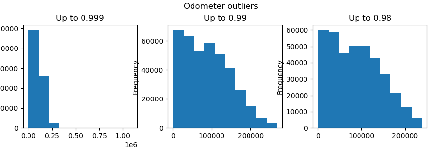
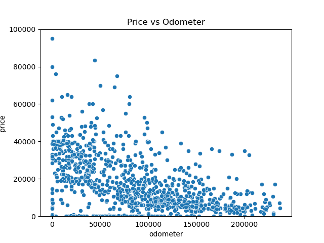
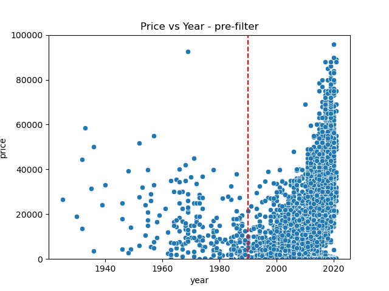
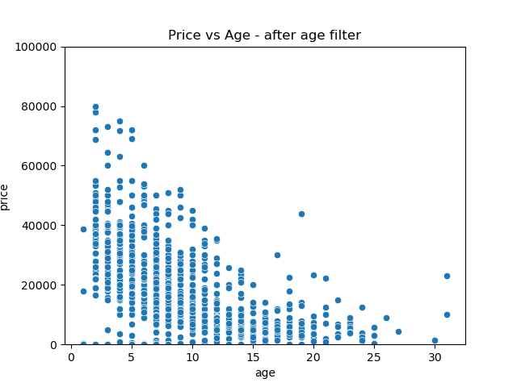
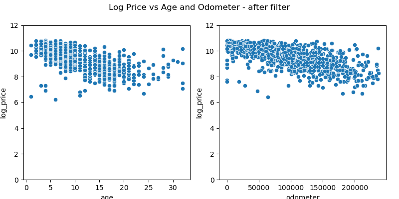
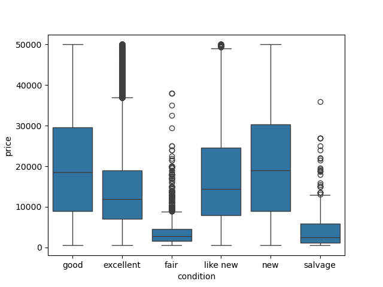
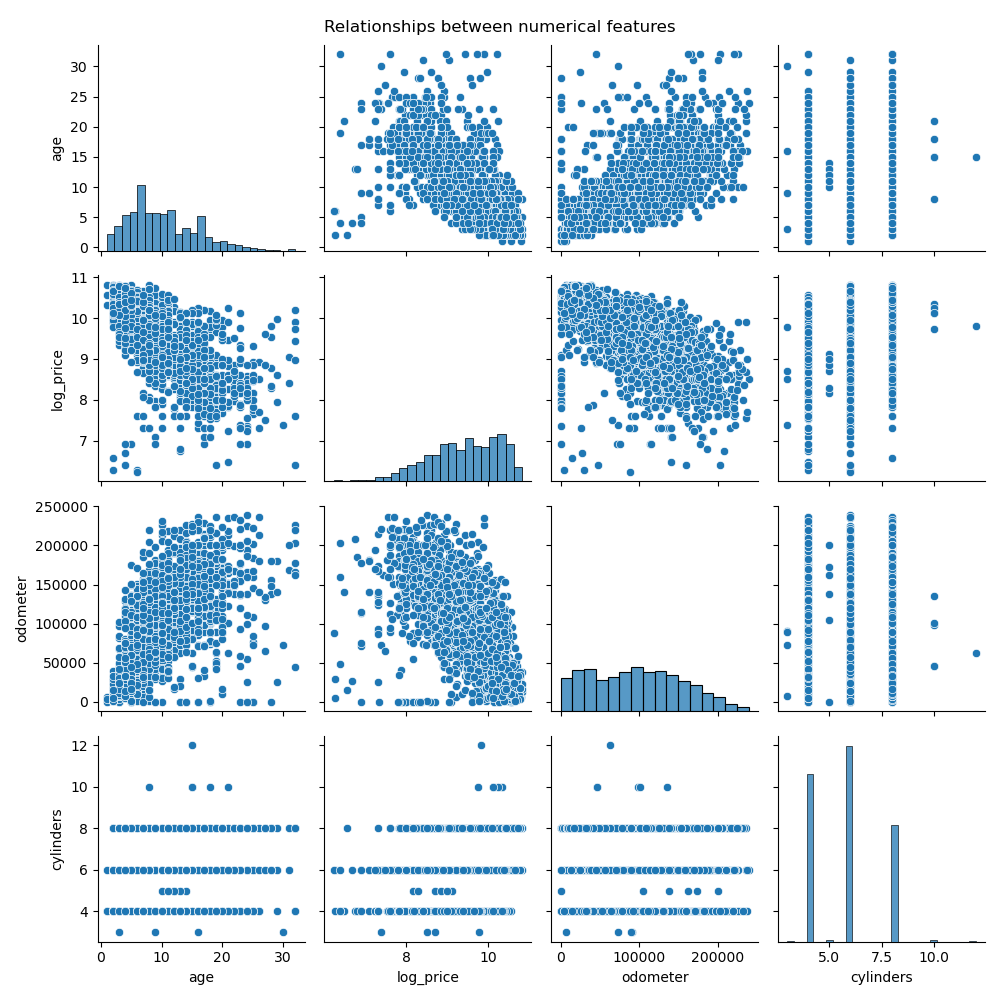
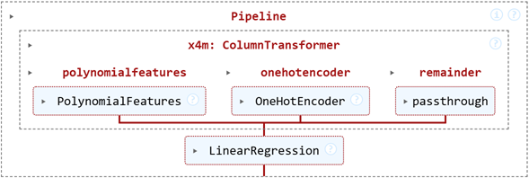
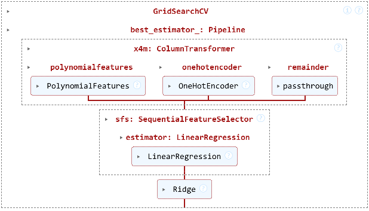
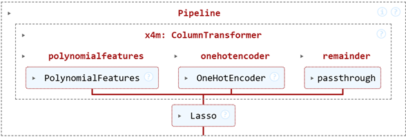

# Introduction

This is a homework assignment for an AI/ML class from UC Berkeley, 2025.  
Required Assignment 11.1

Final Jupyter Notebook: https://github.com/dshavoc/aiml-assignment-11.1/blob/master/assignment11_1.ipynb

Early Jupyter notebook with unpolished developmental notes: https://github.com/dshavoc/aiml-assignment-11.1/blob/master/prompt_II_bloody.ipynb

# Overview

In this assignment I explore and analyze a provided data set on used cars (pared down from a dataset found on Kaggle) following a lite CRISP-DM process.

# Process

## Business Understanding

The client is a used-car lot. They need to know what factors drive price of a used car so they can set competitive prices and maximize profit.

The task in terms of data is to identify relationships between parameters and vehicle price using multiple data formulations and regression models. Each model will estimate the degree to which each feature contributes to the price. The features that contribute most positively or negatively to price will be of particular interest to the used car lot.

But first, the data must be cleaned; columns transformed and normalized as needed, and potentially combined.

On data reduncancy: there are several columns that carry repeated information, such as {'state' and 'region'}, {'manufacturer' and 'model'}. It could be argued that all the information contained in 'state' is represented by 'region' and so 'state' may be dropped. Likewise, 'make' could be dropped. Dropping the redundant columns would reduce the dimensionality of the data, but would discard some information that may be directly relevant to the client. It's possible the client cares about a trend by state or manufacturer, and those trends can be read directly from the model if the redundant columns are retained. That may find value if the number of columns (features) they add to the data is not too great a drawback.

## Data Understanding

The source data has many problems that must be addressed.

The original data has 426,880 samples (rows).

1. Columns with little missing data. Rows with missing data in these columns is dropped:
    - 'year' (<1%)
    - 'manufacturer' (4%)
    - 'model' (1%)
    - 'fuel' (1%)
    - 'odometer' (1%)
    - 'title_status' (2%)
    - 'transmission' (1%)

2. Drop columns that are not expected to bear significant predictive value:
    - 'VIN' - no predictive value
    - 'ID' - no predictive value
    - 'region' - 404 unique columns with limited predictive value

3. Fill missing values with 'NA' in columns that may bear significant predictive value:
    - 'drive' (missing 31%)
    - 'size' (missing 72%)
    - 'type' (missing 22%)
    - 'paint_color' (missing 31%)

4. Replace missing values in 'condition' with the low-middling value 'good'.
    - If it was in a more desirable condition, that condition likely would have been claimed.
    - _Note_: This also happens to be the most common value, but that wasn't the reason it was chosen.

5. Inspect 'odometer' and remove outliers.
    - Some show millions of miles!
    - Threw out odometer values above 240k miles, the 98th percentile.

    

    

6. Investigate price over year and remove outliers.
    - Prices seem to follow one trend back 30 years, and another trend as they become vintage. Let us consider only the last 30 years for the used car market in question.
    - It seems more useful for modeling to represent year as an age. A new column 'age' is created, with values relative to the most recent vehicle.

    

    

7. Investigate price, remove outliers, and log transform.
    - Many vehicles are listed for a price of \$0, and some were listed for \$ millions. Prices below \$500 and above \$50k are removed. This corresponds to quantile range [0.10, 0.97].
    - From the previous plots it appears price is exponential. For training, a new column 'log_price' is added as the natural logarithm of the price. From the image below, a more linear trend can be observed.

    

8. Inspect price vs condition
    - Price has a turbulent relationship with condition. It may bear little regression value.

    

9. Convert 'cylinders' column to numerical.
    - The column is represented as categorical data ("4 cylinders", "8 cylinders"), but bears practically numerical information (4, 8).
    - Vehicles with cylinder data missing are dropped.

10. Drop the 8% of cars not running on gas.

11. Simplify 'manufacturer' column.
    - Out of 42 manufacturers, the top 23 represent 94.3% of all sales. For this exercise, drop all vehicles not in the top 23.
    - Those that remain include:
    ```
    ['ford', 'chevrolet', 'toyota', 'honda', 'nissan', 'jeep', 'gmc',
       'dodge', 'ram', 'bmw', 'subaru', 'mercedes-benz', 'hyundai', 'lexus',
       'volkswagen', 'kia', 'chrysler', 'audi', 'acura', 'cadillac',
       'infiniti', 'buick', 'mazda']
    ```

12. Summary:
    - The resulting "cleaned" data has been purged of much of the data that seemed useless, questionable, or inconveniently ill-fitting for the scope of this exercise. Out of the original 426,880 samples, 166,629 remain. This should be more than adequate for this exercise.
    - Here's a glance at a pair plot of the resulting numerical data:

    

    Observations:
    - Five-cylinder cars have more narrow price, odometer, and age. It seems that the design didn't catch on.
    - High-cylinder engines are reliably more expensive, and tend to have lower odometer readings, perhaps indicating that they have a shorter service life.
    - The correlation is clear, yet poor. The performance of the models will likely be similarly poor.

## Data Preparation


Three data formulations were chosen for testing, based on varying intuitive lines of thought. The following are the common steps:

1. Select a sub-set of features from the cleaned data from the Data Understanding section that seems to bear predictive qualities.
2. Apply column transformation to the selected columns:
    1. One-hot coding of categorical features
    2. Ordinal encoding categorical features into numerical features
    3. Regularization of numerical features
    
> One big lesson emerged from the process of attempting column transformation using column transformers and pipelines: stages of a column transformer can only act on input features. It was desired to Ordinal Encode the 'condition' feature (convert from categorical to numeric), then regularize it, then include the numerical 'condition' with all other numerical features in the PolynomialFeatures transform. That behavior is not supported because the output of a column transformer is a Numpy ndarray, and the input of the next column transformer must be a DataFrame!

| Data Set | Description | Predictors |
| -- | -- | -- |
| 0 | Numerical values only as a benchmark/reference | 3 |
| 1 | Profile vehicles specifically by vehicle model | ~20k |
| 2 | Profile vehicles generally, by manufacturer and type | ~50 |
| 3 | Profile vehicles with all numerical minimal categorical data | ~30 |

**Notes on Data Sets:**
* Data Set 1 had difficulty in allocating 40+ GB of memory, so was mostly unused.
* Data Set 2 uses an Ordinal Encoder on 'condition', which sounded good at the beginning because it's positively correlated with price. Later I came to realize that ordinal encoding inserts an assumption of relationship between values of 'condition' that are not truthful. Standard scaler is applied on all numerical features after the ordinal encoder. Includes 'state' column.
* Data Set 3 abandons the ordinal encoder and uses one-hot encoding on 'condition'.
* Data Set 3 is the primary data set used to train the models that follow. Its predictors include:
```
['age', 'odometer', 'cylinders', 'manufacturer', 'condition', 'type']
```
* All data sets apply a standard scaler. This is done *before* the train/test split so that PolynomialFeatures may be done in the pipeline. I understand that normalizing should be done *after* the test/train split. But then the normalizing would have to be done outside of the pipeline, meaning new data to be predicted would have to likewise be manually transformed before going into the pipeline, which is not ideal. **I don't know how to solve this problem** and spent about 8 hours on it.

## Modeling

Three models are formulated and used on varying data sets. Through the course of trial and error, both data sets and models were refined. Many runs were taken, but only the ones that bear final utility will be reported here. More results are captured in the comments of the Jupyter notebooks.

### Model 0 - Simple Linear Regression



This pipeline one-hot encodes categorical features and performs 2nd order polynomial feature combination on numerical features. A linear regression model is fit to the transformed features.

This model trained in 0.5 seconds. Results are captured in the Evaluation section.

### Model 1 - Ridge Regression with Sequential Feature Selection and Grid Search Cross Validation



This pipeline one-hot encodes categorical features and performs 2nd order polynomial feature combination on numerical features. A sequential feature selector selects the most predictive parameters based on a linear regression model, then a Ridge regression model is fit to the selected features. A grid search finds the number of features and the Ridge $\alpha$ parameter that minimizes the RMSE.

The process of training this model through 9 combinations of grid search hyperparameters and 3 folds took 68 minutes. Results are captured in the Evaluation section.

Best estimator parameters:
* $\alpha$ = 0.04
* `n_features_to_select` = 32


### Model 2 - Lasso Regression with Grid Search Cross Validation



This pipeline one-hot encodes categorical features and performs 2nd order polynomial feature combination on numerical features. A Lasso regression model is fit to the transformed features. A grid search finds the Lasso $\alpha$ parameter that minimizes the RMSE.

The process of training this model through 4 hyperparameters and 3 folds took 4 seconds. Results are captured in the Evaluation section.

## Evaluation

The evaluation metric is Root Mean Squared Error (RMSE), because its value is on the same scale as the input, so it's somewhat intuitive. The input is a combination of one-hot and normalized, lending the RMSE value toward a range of -1 to +1.

| Model | Data Set | Train RMSE | Test RMSE |
| -- | -- | -- | -- |
| Model 0 - Simple Linear | 0 | 0.48839664260876164 | 0.48825000707798155
| Model 0 - Simple Linear | 3 | 0.4403439541900469 | 0.4411088124336842
| Model 1 - LR SFS Ridge Grid | 3 | 0.4410263881603768 | 0.44367067149692796
| Model 2 - Lasso Grid | 3 | 0.47521290064989435 | 0.47703057358973233

Unsurprisingly, the richer information in Data Set 3 allowed for better predictive capability than the numerical-only Data Set 0. Once demonstrated, Data Set 3 was used for each model.

Surprisingly, the best-performing model was the simple Linear Regression, which slightly outperformed the Ridge model with sequential feature selection (but it's close enough that it could be considered a tie); and both Linear and Ridge outperformed Lasso by a larger yet modest margin.

## Deployment

The two best-performing models predict the following parameter importance.

**Model 0 insights: top 20 parameter weights**:

| Parameter | Coefficient | Magnitude |
| -- | -- | -- |
| onehotencoder__condition_salvage |	-0.5598149253181749	| 0.5598149253181749
| polynomialfeatures__age |	-0.500731782049964	| 0.500731782049964
| onehotencoder__condition_fair |	-0.4209109629239038	| 0.4209109629239038
| onehotencoder__type_offroad |	0.4179057639519285	| 0.4179057639519285
| onehotencoder__manufacturer_lexus |	0.3226272932829935	| 0.3226272932829935
| onehotencoder__type_mini-van |	-0.281474411540667	| 0.281474411540667
| onehotencoder__condition_excellent |	0.2777627057677549	| 0.2777627057677549
| onehotencoder__condition_good |	0.2517321926547864	| 0.2517321926547864
| onehotencoder__manufacturer_audi |	0.2507693488773837	| 0.2507693488773837
| onehotencoder__manufacturer_chrysler |	-0.24928963605901155	| 0.24928963605901155
| onehotencoder__type_hatchback |	-0.24918465800149445	| 0.24918465800149445
| polynomialfeatures__cylinders |	0.23980234202722525	| 0.23980234202722525
| onehotencoder__type_sedan |	-0.23024800085293107	| 0.23024800085293107
| onehotencoder__condition_new |	0.22685800389185667	| 0.22685800389185667
| onehotencoder__condition_like new |	0.22437298592769153	| 0.22437298592769153
| onehotencoder__manufacturer_dodge |	-0.20837845488791476	| 0.20837845488791476
| polynomialfeatures__odometer |	-0.20317539462091533	| 0.20317539462091533
| onehotencoder__type_truck |	0.1973844561281097	| 0.1973844561281097
| onehotencoder__manufacturer_kia |	-0.19476131180172734	| 0.19476131180172734
| onehotencoder__manufacturer_toyota |	0.19300193708419	| 0.19300193708419


**Model 1 insights: top 20 parameter weights**:
| Parameter | Coefficient | Magnitude |
| -- | -- | -- |
| onehotencoder__condition_salvage | -0.8375829024065586 | 0.8375829024065586
| onehotencoder__condition_fair | -0.6784442198118715 | 0.6784442198118715
| polynomialfeatures__age | -0.4997045561857069 | 0.4997045561857069
| onehotencoder__type_mini-van | -0.46310457033371244 | 0.46310457033371244
| onehotencoder__type_hatchback | -0.4213323352329365 | 0.4213323352329365
| onehotencoder__type_sedan | -0.4104215290136868 | 0.4104215290136868
| onehotencoder__manufacturer_lexus | 0.4034277240933308 | 0.4034277240933308
| onehotencoder__manufacturer_audi | 0.33468185929981176 | 0.33468185929981176
| onehotencoder__type_NA | -0.2746580705093187 | 0.2746580705093187
| onehotencoder__manufacturer_toyota | 0.2741967558486087 | 0.2741967558486087
| onehotencoder__manufacturer_mercedes-benz | 0.25765129296982336 | 0.25765129296982336
| onehotencoder__type_wagon | -0.2544276736377765 | 0.2544276736377765
| polynomialfeatures__cylinders | 0.24537992410021608 | 0.24537992410021608
| onehotencoder__manufacturer_subaru | 0.22997874905441323 | 0.22997874905441323
| onehotencoder__manufacturer_bmw | 0.22687551255145705 | 0.22687551255145705
| onehotencoder__manufacturer_jeep | 0.20815724858705636 | 0.20815724858705636
| onehotencoder__type_SUV | -0.20234274510184505 | 0.20234274510184505
| polynomialfeatures__odometer | -0.20017640871931358 | 0.20017640871931358
| onehotencoder__type_van | -0.1927901526018076 | 0.1927901526018076
| onehotencoder__manufacturer_acura | 0.18812617898230632 | 0.18812617898230632

**Both models agree these are in the top 15 (most desirable) parameters**
| Parameter | Model 0 Coefficient | Model 1 Coefficient |
| -- | -- | -- |
| onehotencoder__manufacturer_lexus | 0.3226272932829935 | 0.4034277240933308
| onehotencoder__manufacturer_audi | 0.2507693488773837 | 0.33468185929981176
| polynomialfeatures__cylinders | 0.23980234202722525 | 0.24537992410021608
| onehotencoder__manufacturer_toyota | 0.19300193708419 | 0.2741967558486087
| onehotencoder__manufacturer_mercedes-benz | 0.17290765643310704 | 0.25765129296982336
| onehotencoder__manufacturer_bmw | 0.14261168895766457 | 0.22687551255145705
| onehotencoder__manufacturer_subaru | 0.14175857953754598 | 0.22997874905441323

**Both models agree these are in the bottom 15 (least desirable) parameters**
| Parameter | Model 0 Coefficient | Model 1 Coefficient |
| -- | -- | -- |
| onehotencoder__condition_salvage | -0.5598149253181749 | -0.8375829024065586
| polynomialfeatures__age | -0.500731782049964 | -0.4997045561857069
| onehotencoder__condition_fair | -0.4209109629239038 | -0.6784442198118715
| onehotencoder__type_mini-van | -0.281474411540667 | -0.46310457033371244
| onehotencoder__manufacturer_chrysler | -0.24928963605901155 | -0.1701655028411995
| onehotencoder__type_hatchback | -0.24918465800149445 | -0.4213323352329365
| onehotencoder__type_sedan | -0.23024800085293107 | -0.4104215290136868
| onehotencoder__manufacturer_dodge | -0.20837845488791476 | -0.1269422387296148
| polynomialfeatures__odometer | -0.20317539462091533 | -0.20017640871931358

## Next Steps
* Procure better data with higher quality features, such as horsepower, and MSRP new.
* Much of the data was thrown out because it didn't seem to fit a local linearization. Try creating multiple models that fit different regions of input space. Clustering could be used to identify the regions of input space and the number of models.
